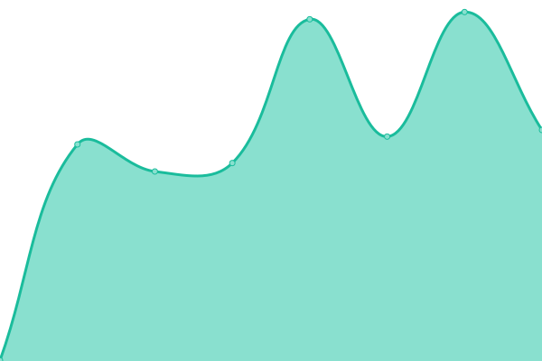
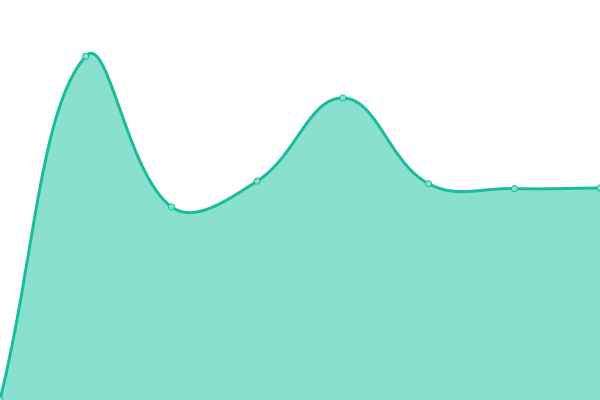

# [📈 Live Status](https://status.flodoerr.com): <!--live status--> **🟧 Partial outage**

This repository contains the open-source uptime monitor and status page for [Flo Dörr](https://flodoerr.com/), powered by [Upptime](https://github.com/upptime/upptime).

With [Upptime](https://upptime.js.org), you can get your own unlimited and free uptime monitor and status page, powered entirely by a GitHub repository. We use [Issues](https://github.com/flokol120/uptime/issues) as incident reports, [Actions](https://github.com/flokol120/uptime/actions) as uptime monitors, and [Pages](https://status.flodoerr.com) for the status page.

<!--start: status pages-->
<!-- This summary is generated by Upptime (https://github.com/upptime/upptime) -->
<!-- Do not edit this manually, your changes will be overwritten -->
<!-- prettier-ignore -->
| URL | Status | History | Response Time | Uptime |
| --- | ------ | ------- | ------------- | ------ |
|  [Portfolio](https://flodoerr.com) | 🟩 Up | [portfolio.yml](https://github.com/flokol120/uptime/commits/HEAD/history/portfolio.yml) | 

 357ms
     
 | 

<a href="https://status.flodoerr.com/history/portfolio">98.18%</a>
    

|  [Blog](https://blog.flodoerr.com) | 🟥 Down | [blog.yml](https://github.com/flokol120/uptime/commits/HEAD/history/blog.yml) | 

 327ms
     
 | 

<a href="https://status.flodoerr.com/history/blog">76.29%</a>
    

|  Secret 1 | 🟥 Down | [secret-1.yml](https://github.com/flokol120/uptime/commits/HEAD/history/secret-1.yml) | 

 420ms
     
 | 

<a href="https://status.flodoerr.com/history/secret-1">23.24%</a>
    

|  Secret 2 | 🟩 Up | [secret-2.yml](https://github.com/flokol120/uptime/commits/HEAD/history/secret-2.yml) | 

 654ms
     
 | 

<a href="https://status.flodoerr.com/history/secret-2">99.49%</a>
    

|  Secret 3 | 🟩 Up | [secret-3.yml](https://github.com/flokol120/uptime/commits/HEAD/history/secret-3.yml) | 

 893ms
     
 | 

<a href="https://status.flodoerr.com/history/secret-3">85.74%</a>
    

|  Secret 4 | 🟩 Up | [secret-4.yml](https://github.com/flokol120/uptime/commits/HEAD/history/secret-4.yml) | 

 698ms
     
 | 

<a href="https://status.flodoerr.com/history/secret-4">99.52%</a>
    

|  Secret 5 | 🟩 Up | [secret-5.yml](https://github.com/flokol120/uptime/commits/HEAD/history/secret-5.yml) | 

 387ms
     
 | 

<a href="https://status.flodoerr.com/history/secret-5">99.67%</a>
    

|  Secret 6 | 🟥 Down | [secret-6.yml](https://github.com/flokol120/uptime/commits/HEAD/history/secret-6.yml) | 

 434ms
     
 | 

<a href="https://status.flodoerr.com/history/secret-6">76.29%</a>
    

<!--end: status pages-->

[**Visit our status website →**](https://status.flodoerr.com)

## 📄 License

- Powered by: [Upptime](https://github.com/upptime/upptime)
- Code: [MIT](./LICENSE) © [Flo Dörr](https://flodoerr.com/)
- Data in the `./history` directory: [Open Database License](https://opendatacommons.org/licenses/odbl/1-0/)
